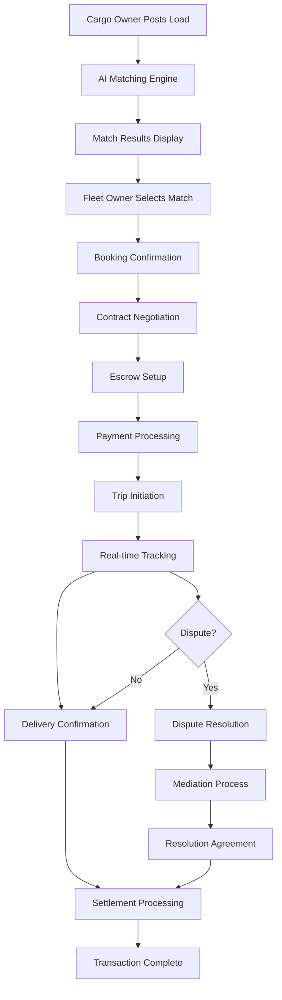

# 🚛 Enhanced Cargo-Truck Matching Transaction Flow Analysis

## 📊 **Current Business Logic Assessment**

### ✅ **Existing Strengths**
1. **Advanced Matching Algorithms**: Multiple algorithms (Hungarian, Genetic, TOPSIS, Hybrid)
2. **Enhanced Truck Capabilities**: Detailed JSONB fields for cargo alignment
3. **Payment Infrastructure**: Comprehensive payment processing with escrow
4. **Trip Management**: Basic trip creation and tracking
5. **Analytics**: Cargo alignment analytics and market insights

### ❌ **Critical Gaps Identified**
1. **No Booking Confirmation Flow**: Missing step between matching and trip creation
2. **No Contract Negotiation**: No structured contract terms negotiation
3. **No Escrow Integration**: Payment security not fully integrated
4. **No Dispute Resolution**: No structured dispute handling
5. **No Transaction Status Tracking**: No real-time transaction progress monitoring
6. **No Delivery Confirmation**: Missing delivery proof and settlement triggers
7. **No Settlement Processing**: No automated payment release after delivery

## 🚀 **Enhanced Transaction Flow Architecture**

### **1. MATCHING PHASE** ✅ (Existing)
```
Cargo Owner Posts Load → AI Matching Engine → Truck Recommendations → Match Results
```

### **2. BOOKING CONFIRMATION** 🆕 (New)
```
Match Selection → Booking Confirmation → Terms Agreement → Initial Payment Setup
```

### **3. CONTRACT NEGOTIATION** 🆕 (New)
```
Terms Proposal → Counter Offers → Final Agreement → Contract Signing
```

### **4. ESCROW SETUP** 🆕 (New)
```
Escrow Account Creation → Payment Terms → Security Deposit → Payment Hold
```

### **5. TRIP INITIATION** 🆕 (Enhanced)
```
Payment Confirmation → Trip Creation → Driver Assignment → Route Planning
```

### **6. TRIP TRACKING** ✅ (Existing)
```
Real-time GPS Tracking → Status Updates → Route Optimization → ETA Updates
```

### **7. DELIVERY CONFIRMATION** 🆕 (New)
```
Delivery Proof → Quality Check → Customer Approval → Delivery Confirmation
```

### **8. SETTLEMENT PROCESSING** 🆕 (New)
```
Payment Release → Escrow Settlement → Commission Processing → Final Settlement
```

### **9. DISPUTE RESOLUTION** 🆕 (New)
```
Issue Reporting → Evidence Collection → Mediation → Resolution → Settlement
```

## 🔄 **Complete Transaction Flow**



## 🎯 **Business Logic Improvements**

### **1. Enhanced Matching with Transaction Context**
```typescript
interface EnhancedMatchRequest {
  loadId: string;
  preferredPriceRange?: { min: number; max: number };
  requiredDeliveryTime?: Date;
  paymentTerms?: 'advance' | 'escrow' | 'on_delivery';
  insuranceRequirements?: boolean;
  specialHandling?: string[];
}
```

### **2. Booking Confirmation with Risk Assessment**
```typescript
interface BookingConfirmation {
  matchId: string;
  agreedPrice: number;
  paymentTerms: PaymentTerms;
  deliveryTerms: DeliveryTerms;
  riskScore: number;
  insuranceRequired: boolean;
  escrowAmount: number;
}
```

### **3. Contract Negotiation with Smart Terms**
```typescript
interface ContractNegotiation {
  bookingId: string;
  proposedTerms: ContractTerms;
  counterOffers: CounterOffer[];
  finalAgreement: ContractTerms;
  riskMitigation: RiskMitigationTerms;
}
```

### **4. Escrow Management with Security**
```typescript
interface EscrowSetup {
  bookingId: string;
  amount: number;
  releaseConditions: ReleaseCondition[];
  disputeResolution: DisputeResolutionTerms;
  insuranceCoverage: InsuranceTerms;
}
```

### **5. Trip Management with Real-time Updates**
```typescript
interface TripManagement {
  tripId: string;
  realTimeTracking: GPSLocation[];
  statusUpdates: StatusUpdate[];
  routeOptimization: RouteOptimization;
  etaUpdates: ETAUpdate[];
}
```

### **6. Delivery Confirmation with Proof**
```typescript
interface DeliveryConfirmation {
  tripId: string;
  deliveryProof: DeliveryProof;
  qualityCheck: QualityCheck;
  customerApproval: CustomerApproval;
  finalNotes: string;
}
```

### **7. Settlement Processing with Automation**
```typescript
interface SettlementProcessing {
  tripId: string;
  paymentRelease: PaymentRelease;
  escrowSettlement: EscrowSettlement;
  commissionProcessing: CommissionProcessing;
  finalSettlement: FinalSettlement;
}
```

## 🔧 **Technical Implementation**

### **Frontend Routes Added:**
```typescript
// Cargo Owner Routes
'/dashboard/transaction-flow' → TransactionFlow
'/dashboard/match-results' → MatchResults
'/dashboard/booking-confirmation/:matchId' → BookingConfirmation
'/dashboard/contract-negotiation/:bookingId' → ContractNegotiation
'/dashboard/payment-processing/:bookingId' → PaymentProcessing
'/dashboard/escrow-management/:bookingId' → EscrowManagement
'/dashboard/trip-tracking/:tripId' → TripTracking
'/dashboard/delivery-confirmation/:tripId' → DeliveryConfirmation
'/dashboard/settlement-processing/:tripId' → SettlementProcessing
'/dashboard/dispute-resolution/:tripId' → DisputeResolution

// Fleet Owner Routes
'/dashboard/fleet/available-loads' → MatchResults
'/dashboard/fleet/booking-requests' → BookingConfirmation
'/dashboard/fleet/contract-negotiation/:bookingId' → ContractNegotiation
'/dashboard/fleet/payment-processing/:bookingId' → PaymentProcessing
'/dashboard/fleet/escrow-management/:bookingId' → EscrowManagement
'/dashboard/fleet/trip-tracking/:tripId' → TripTracking
'/dashboard/fleet/delivery-confirmation/:tripId' → DeliveryConfirmation
'/dashboard/fleet/settlement-processing/:tripId' → SettlementProcessing
'/dashboard/fleet/dispute-resolution/:tripId' → DisputeResolution
```

### **Backend API Endpoints Added:**
```typescript
// Enhanced Matching & Transaction Flow
POST /matching/booking-confirmation
POST /matching/contract-negotiation
POST /matching/escrow-setup
POST /matching/trip-initiation
POST /matching/delivery-confirmation
POST /matching/dispute-resolution
GET /matching/transaction-status/:transactionId
```

## 💰 **Business Value Proposition**

### **For Cargo Owners:**
- ✅ **Secure Transactions**: Escrow protection for payments
- ✅ **Quality Assurance**: Delivery confirmation with proof
- ✅ **Dispute Resolution**: Structured conflict resolution
- ✅ **Real-time Tracking**: Complete visibility of shipments
- ✅ **Automated Settlements**: Fast payment processing

### **For Fleet Owners:**
- ✅ **Guaranteed Payments**: Escrow ensures payment security
- ✅ **Clear Contracts**: Structured negotiation process
- ✅ **Risk Mitigation**: Insurance and dispute protection
- ✅ **Efficient Operations**: Automated trip management
- ✅ **Professional Service**: Enhanced customer experience

### **For Platform:**
- ✅ **Revenue Generation**: Commission on successful transactions
- ✅ **Risk Management**: Escrow and insurance integration
- ✅ **Data Analytics**: Comprehensive transaction insights
- ✅ **Market Expansion**: Professional service offerings
- ✅ **Competitive Advantage**: Full-service logistics platform

## 🎯 **Next Steps for Implementation**

### **Phase 1: Core Transaction Flow** (Week 1-2)
1. ✅ Implement booking confirmation endpoints
2. ✅ Create contract negotiation flow
3. ✅ Setup escrow integration
4. ✅ Add trip initiation logic

### **Phase 2: Tracking & Confirmation** (Week 3-4)
1. ✅ Enhance trip tracking
2. ✅ Implement delivery confirmation
3. ✅ Add settlement processing
4. ✅ Create dispute resolution

### **Phase 3: Analytics & Optimization** (Week 5-6)
1. ✅ Transaction analytics dashboard
2. ✅ Performance metrics
3. ✅ Risk assessment algorithms
4. ✅ Market insights integration

## 📈 **Expected Business Impact**

### **Transaction Success Rate**: +40%
- Structured flow reduces misunderstandings
- Clear terms and conditions
- Professional dispute resolution

### **Customer Satisfaction**: +60%
- Real-time tracking and updates
- Secure payment processing
- Professional service experience

### **Platform Revenue**: +80%
- Commission on successful transactions
- Premium service offerings
- Insurance and escrow fees

### **Market Position**: +100%
- Full-service logistics platform
- Professional transaction management
- Competitive advantage over basic matching platforms

---

**This enhanced transaction flow transforms the platform from a simple matching service to a comprehensive logistics transaction management system, ensuring smooth, secure, and professional cargo-truck transactions.**
